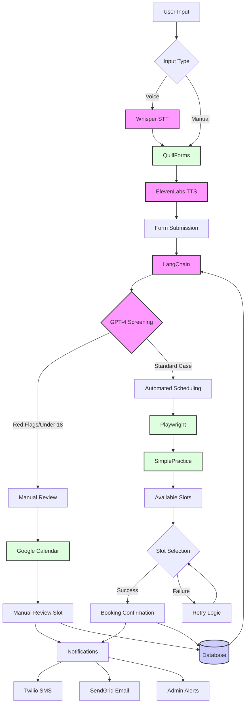

# Detailed Technical Pipeline

## System Flow Chart



# Detailed Technical Pipeline

## 1️⃣ Frontend Interaction Layer

### Tools:
- **QuillForms**: Collects user input with manual and voice options
- **Whisper (STT)**: Converts voice input into text for QuillForms fields
- **ElevenLabs (TTS)**: Provides real-time, natural-sounding voice responses to guide users through the form

### Flow:
#### User Input:
- Users interact with the form via:
  - Manual typing
  - Voice input (processed by Whisper)
- GPT-4 assists by autofilling fields or clarifying user responses
- ElevenLabs reads back AI-generated prompts or confirmations

#### Data Submission:
- Once completed, the form data is sent to the backend for screening

## 2️⃣ Backend Screening & Validation

### Tools:
- **LangChain**: Manages workflows and integrates GPT-4 for logic
- **GPT-4**: Analyzes user submissions for red flags and validation
- **Database**: PostgreSQL or MySQL for storing temporary and validated data

### Flow:
#### Screening:
- LangChain passes user submissions to GPT-4 to:
  - Detect critical psychiatric concerns (e.g., "suicide")
  - Flag users under 18 for manual review
  - Classify users into:
    - Standard Cases: Proceed to automated scheduling
    - Flagged Cases: Redirect to manual scheduling

#### Validation:
- Backend ensures:
  - All required fields are completed
  - Data formats (e.g., DOB, email) are correct
  - No duplicate submissions exist

#### Routing:
- Standard Cases: Routed to automated scheduling
- Flagged Cases: Redirected to Google Calendar for manual review

## 3️⃣ Scheduling System

### Automated Scheduling for Standard Cases

#### Tools:
- **Playwright**: Browser automation for interacting with SimplePractice
- **LangChain**: Provides intelligent decision-making for slot selection

#### Flow:
##### Playwright Logs into SimplePractice:
- Secure credentials are used to log into the SimplePractice portal
- The automation script navigates to the Calendar section

##### HTML Element Identification:
- Playwright identifies key elements on the SimplePractice calendar:
  - Time Slots:
    - Extract slots by locating calendar cells (e.g., `<div class="calendar-slot">`)
    - Use CSS selectors or XPath to target elements dynamically
  - Booked Appointments:
    - Identify elements marked as booked (e.g., `<div class="appointment">`)
    - Parse attributes like data-time or data-clinician to retrieve details

##### Example Code:
```javascript
const slots = await page.$$(".calendar-slot:not(.booked)"); // Select available slots
for (const slot of slots) {
  const time = await slot.getAttribute("data-time");
  console.log(`Available slot: ${time}`);
}
```

##### Data Extraction:
- Extract available slots and format them into a structured JSON object:
```json
[
  { "date": "2024-12-24", "time": "3:00 PM", "clinician": "Dr. Smith" },
  { "date": "2024-12-24", "time": "4:00 PM", "clinician": "Dr. Taylor" }
]
```

##### Slot Selection:
- LangChain evaluates the extracted slots against user preferences:
  - Example: If a user requests "next Friday afternoon," LangChain selects the closest matching slot

##### Slot Booking:
- Playwright interacts with the calendar to book the selected slot:
  - Locate the desired slot element by its attributes (e.g., data-time and data-date)
  - Simulate a click and confirm the booking in the UI

##### Example Code:
```javascript
const slot = await page.$('div[data-time="3:00 PM"][data-date="2024-12-24"]');
if (slot) {
  await slot.click();
  await page.click("button.confirm-booking");
  console.log("Slot booked successfully!");
}
```

##### Error Handling:
- If a slot becomes unavailable during booking:
  - LangChain retries with the next best slot
  - Logs errors for admin review if retries fail

### Manual Scheduling for Flagged Cases

#### Tools:
- **Google Calendar API**: Displays manual review slots
- **LangChain**: Guides users to schedule a manual review

#### Flow:
##### Redirect to Google Calendar:
- Flagged users are redirected to a Google Calendar widget embedded on the Mindwell website
- Available manual review slots are displayed dynamically

##### User Selects a Time:
- Users select a manual review slot, which is stored in the backend database

## 4️⃣ Notifications & Updates

### Tools:
- **Twilio**: Sends SMS notifications to users
- **SendGrid**: Sends email confirmations

### Flow:
#### User Notifications:
- Confirmation of appointment details is sent after scheduling
- Flagged users are notified of their manual review time

#### Admin Alerts:
- Slack/Webhook alerts are sent for flagged cases requiring manual intervention

## Error Recovery System

### Error Scenarios:
#### Slot Unavailability:
- LangChain retries with alternative slots
- Notifies the user if retries fail

#### Playwright Failures:
- Scripts include retry logic for failed actions (e.g., missing elements)
- Logs critical errors for manual review

## System Architecture

### Key Components

| Component | Technology | Purpose |
|-----------|------------|----------|
| Frontend Interaction | QuillForms, Whisper, ElevenLabs | Collects user input and provides conversational AI experience |
| Backend Processing | LangChain, GPT-4 | Screens and validates submissions, makes scheduling decisions |
| Browser Automation | Playwright | Logs into SimplePractice, extracts slots, and books appointments |
| Manual Scheduling | Google Calendar API | Displays and manages manual review slots for flagged cases |
| Notifications | Twilio, SendGrid | Sends user confirmations and admin alerts |
| Database | PostgreSQL/MySQL | Stores submissions, scheduling data, and validation results |

## Benefits of This Pipeline

- **Dynamic Scheduling**:
  - Playwright interacts with dynamic web elements like calendar cells and booked slots

- **AI-Driven Decisions**:
  - LangChain ensures slot selection aligns with user preferences

- **Resilience**:
  - Error recovery and retry logic prevent booking failures

- **Scalability**:
  - Modular architecture supports additional clinicians or expanded workflows
