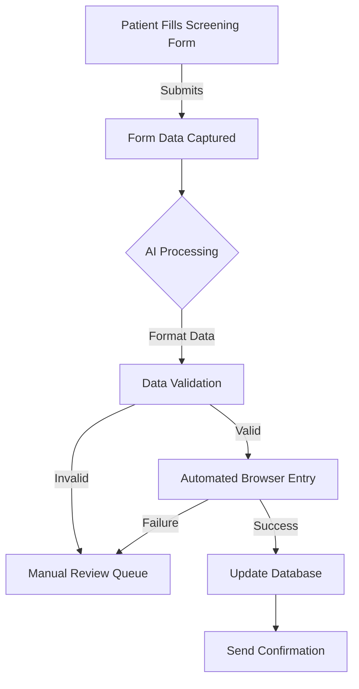
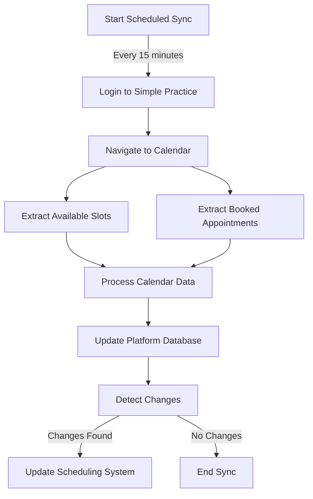

# MindWell Practice Automation

An automated solution for streamlining mental health practice management through intelligent form processing and calendar synchronization.

## 🎯 Project Summary

This project automates the manual data entry process from screening forms into Simple Practice while extracting therapist calendars to enhance scheduling efficiency. It provides a comprehensive solution for mental health practices looking to reduce administrative overhead and improve patient experience.

## ✨ Key Features

- **Automated Form Processing**: Intelligent capture and entry of screening form data
- **Calendar Synchronization**: Real-time extraction and management of therapist availability
- **AI-Enhanced Data Validation**: Smart verification and error detection
- **Seamless Integration**: Direct connection with Simple Practice platform

## 📊 Feasibility Assessment

Overall Project Feasibility Score: 8/10

Component Breakdown:
- Form Data Entry Automation: 9/10
- Calendar Data Extraction: 8/10
- AI-Enhanced Processing: 7/10

## 🔄 Process Flows

### Screening Form Submission

### Calendar Management

## 💪 Benefits

- **Time Savings**: Eliminates 15-20 minutes of manual data entry per patient
- **Error Reduction**: AI-powered validation ensures data accuracy
- **Enhanced Patient Experience**: Faster processing and reduced administrative delays
- **Scalable Operations**: Supports practice growth without proportional administrative overhead

## 🛠 Technical Dependencies

1. **Form System**
   - Custom form builder
   - Secure data storage
   - HIPAA compliance measures

2. **Automation Tools**
   - Steel.dev browser automation framework
   - AI processing capabilities
   - Monitoring system

3. **Integration Requirements**
   - Simple Practice credentials
   - Calendar access permissions
   - Database connectivity

## 📈 Success Metrics

- **Automation Success Rate**: 95%+ successful form entries
- **Time Savings**: 80% reduction in administrative time
- **Data Accuracy**: 99%+ accuracy rate

## 🚀 Implementation Phases

1. **Initial Setup**
   - Form system configuration
   - Automation framework setup
   - Monitoring system establishment

2. **Testing**
   - Small-scale automation trials
   - Calendar sync validation
   - AI processing verification

3. **Full Deployment**
   - Staff training
   - Phased rollout
   - Performance monitoring

## ⚠️ Risk Management

| Risk | Impact | Probability | Mitigation |
|------|---------|------------|------------|
| Interface Changes | High | Low | Robust error detection system |
| Data Accuracy | High | Low | AI validation and manual audits |
| System Downtime | Medium | Low | Automated retry with manual fallback |

## 📊 Business Impact

- **Immediate Benefits**: Reduced manual work, faster processing, improved accuracy
- **Long-term Value**: Scalable management, better resource utilization
- **ROI Indicators**: Staff time savings, reduced errors, improved patient throughput

## 🤝 Contributing

Please read [CONTRIBUTING.md](CONTRIBUTING.md) for details on our code of conduct and the process for submitting pull requests.

## 📝 License

This project is licensed under the MIT License - see the [LICENSE.md](LICENSE.md) file for details

---
For more information or support, please contact the development team.
