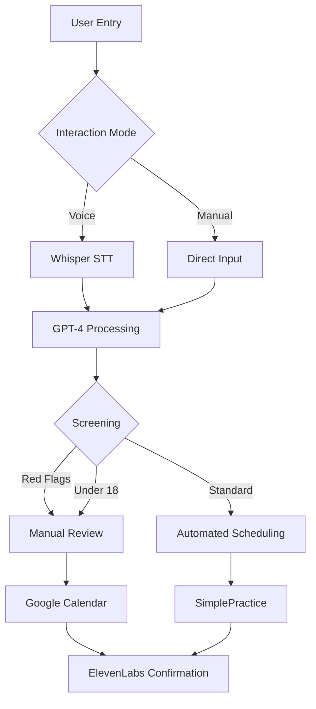

# MindWell Conversational AI Screening System

A next-generation mental health screening system combining voice interaction, AI processing, and automated scheduling.

## Technology Stack
- **Speech-to-Text**: Whisper
- **Natural Language Processing**: GPT-4
- **Text-to-Speech**: ElevenLabs
- **Form System**: QuillForms
- **Calendar Integration**: Google Calendar & SimplePractice

## System Phases

### 1️⃣ Phase 1: Intelligent Form Submission

#### Initial Access
Users begin the screening process through the Mindwell website with two interaction modes:

**Manual Input Mode:**
- Direct text entry into form fields
- Traditional form navigation
- Progress tracking

**Conversational AI Mode:**
- Voice-activated interaction
- Real-time speech processing via Whisper
- Natural voice responses through ElevenLabs
- Context-aware field population

#### AI-Assisted Completion
The system provides intelligent assistance through:

**GPT-4 Processing:**
- Step-by-step guidance
- Smart field auto-completion
- Context understanding (e.g., "next Friday at 2 PM")
- Validation suggestions

**Voice Interaction:**
- Natural language prompts
- Interactive confirmations
- Contextual help
- Error correction

### 2️⃣ Phase 2: Smart Screening & Validation

#### AI Screening Process
GPT-4 analyzes submissions for:

**Clinical Indicators:**
- Critical psychiatric concerns
- Recent hospitalizations
- Risk assessment
- Treatment history

**Age Verification:**
- Under 18 identification
- Parental consent requirements
- Age-appropriate routing

#### Validation Protocols
**Data Integrity:**
- Field completion verification
- Format validation
- Duplicate detection
- Consistency checks

#### Case Routing
**Classification:**
- Standard cases → Automated scheduling
- Under 18 → Manual review
- Red flags → Clinical team review

### 3️⃣ Phase 3: Dynamic Scheduling

#### Manual Review Path
For cases requiring additional screening:

**Process Flow:**
1. Redirect to Google Calendar widget
2. Display available review slots
3. Confirmation of manual screening time
4. Notification system integration

#### Automated Scheduling
For standard cases:

**Browser Agent Actions:**
1. SimplePractice login
2. Slot availability extraction
3. Dynamic calendar updates
4. Automated booking confirmation

### 4️⃣ Phase 4: Communication System

#### Confirmation Process
**Multi-Channel Notifications:**
- Email confirmations
- SMS updates (Twilio)
- Voice confirmations (ElevenLabs)

#### Error Management
**Recovery Protocols:**
1. Automatic retry logic
2. Alternative slot suggestions
3. Manual intervention triggers
4. User communication

## System Architecture

## Technical Challenges & Solutions

| Challenge | Solution | Implementation |
|-----------|----------|----------------|
| Voice Feedback Latency | Response Optimization | API request batching |
| Slot Management | Regular Sync | 15-minute update intervals |
| Review Scheduling | Calendar Integration | Google Calendar API |
| Mode Switching | Clear UI/UX | Visual and audio cues |

## System Benefits

### Enhanced User Experience
- Natural conversation flow
- Multi-modal interaction
- Intelligent assistance
- Real-time feedback

### Clinical Safety
- Comprehensive screening
- Risk detection
- Age-appropriate handling
- Manual review options

### Operational Efficiency
- Automated scheduling
- Dynamic calendar management
- Reduced manual intervention
- Error prevention

### Technical Integration
- API synchronization
- Real-time updates
- Error handling
- Monitoring systems

## Implementation Considerations

### Voice Processing
- Low-latency STT conversion
- Natural TTS responses
- Context maintenance
- Error recovery

### Calendar Management
- Real-time availability
- Conflict prevention
- Sync mechanisms
- Backup protocols

### User Interface
- Mode switching
- Progress indication
- Error messaging
- Help system

## Monitoring & Maintenance

- Performance metrics
- Error tracking
- Usage analytics
- System health monitoring

---

For technical support or system modifications, contact the development team.
